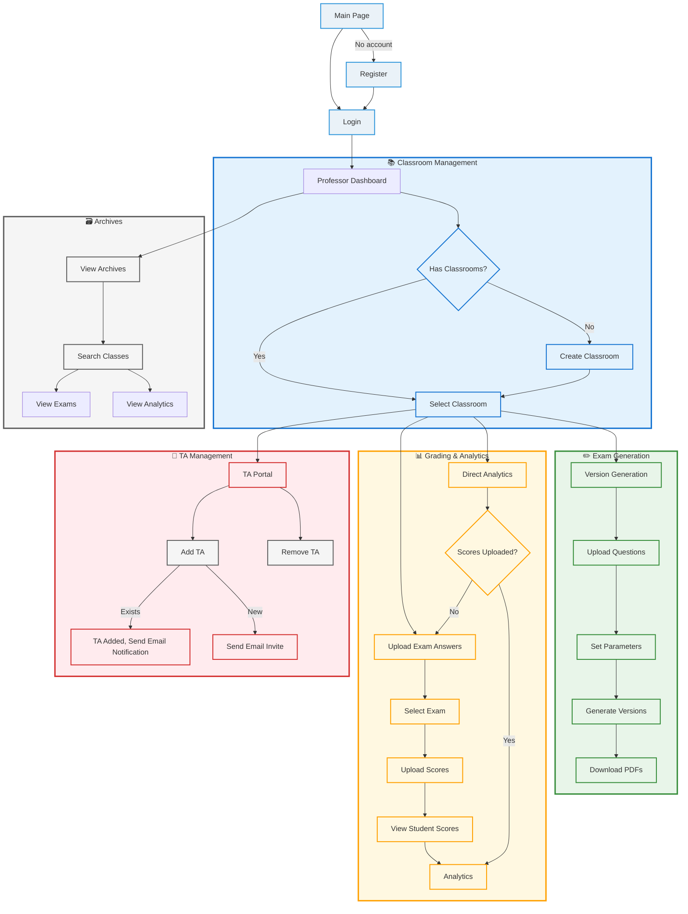
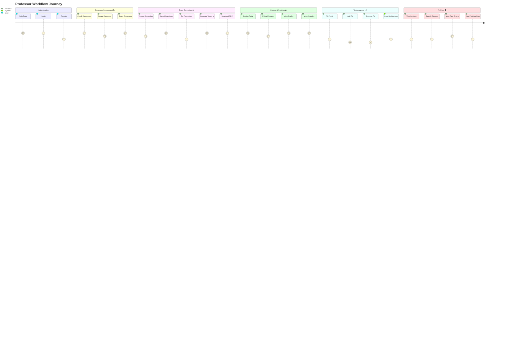
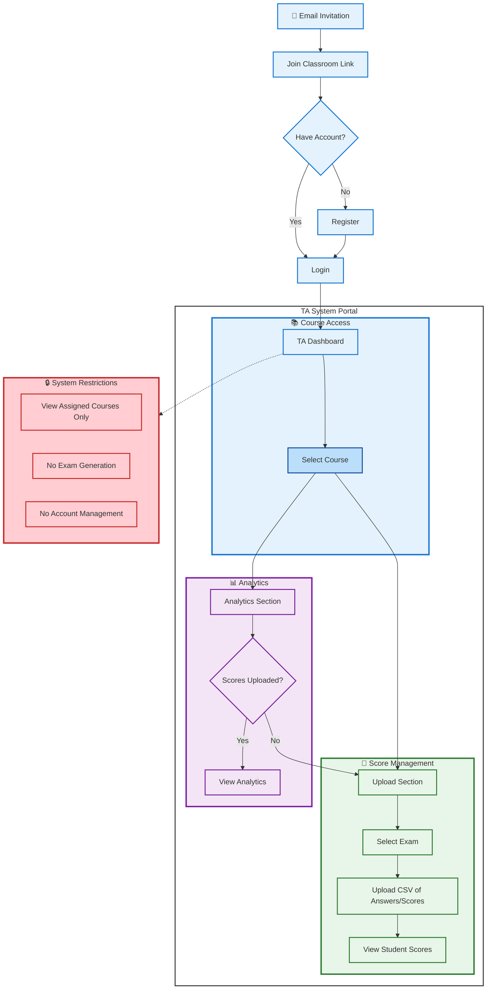
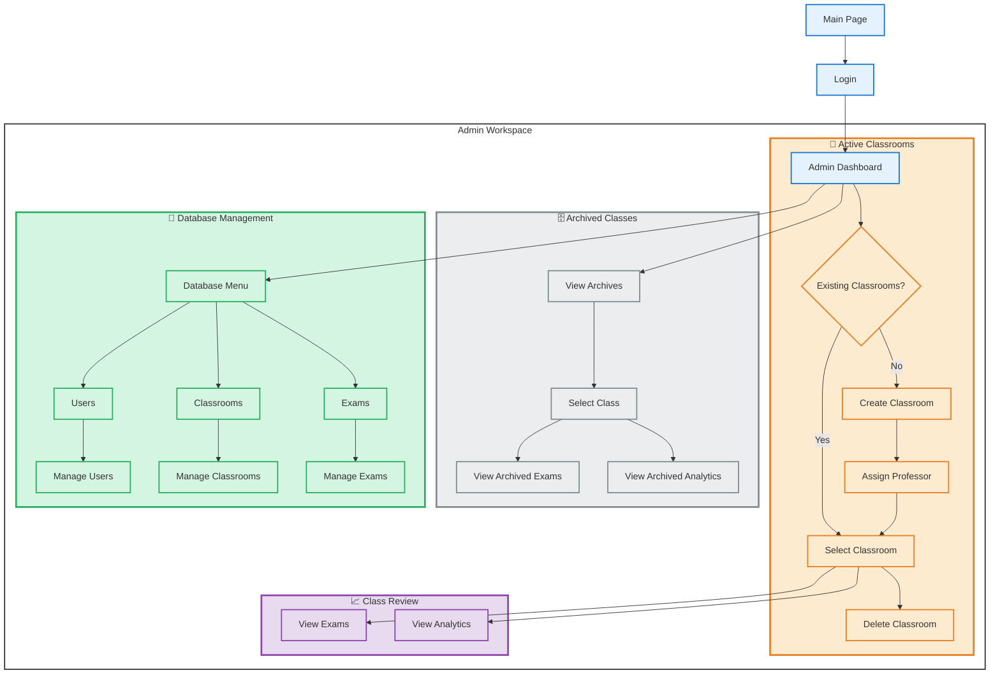
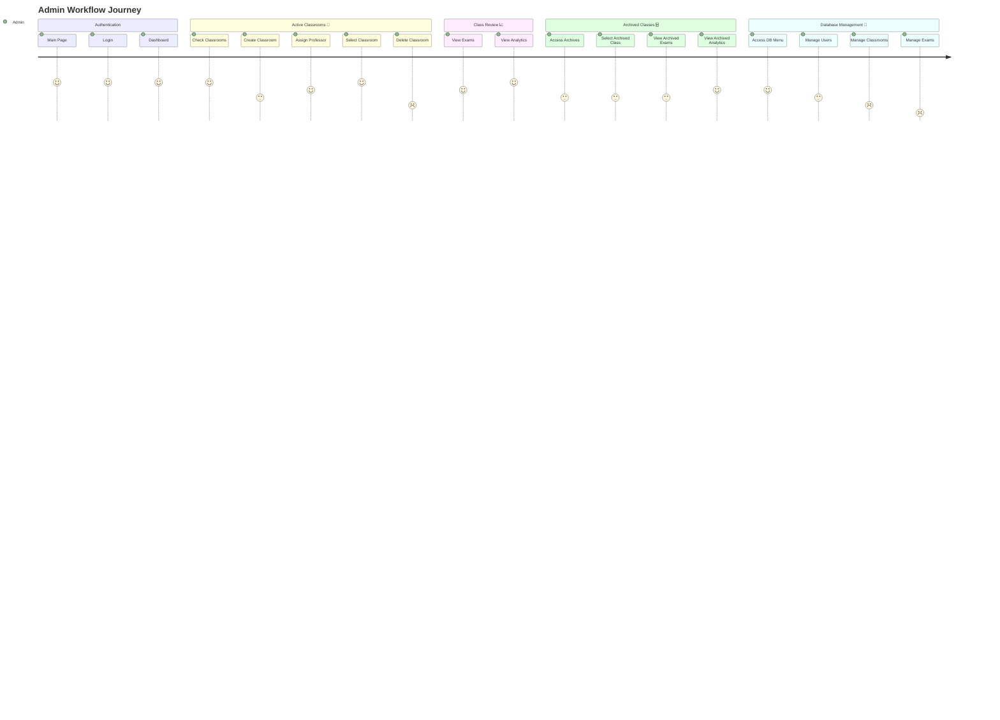

# Project Proposal for \<project 2\>

**Team Members:**  Aliasgar Sakarwala, Ali Afoud, Sahil Chawla, Samyak Jain, Arjun Sampat, Christian Eziekwu, Cooper Ross

## Overview:

### Project purpose or justification (UVP)

**Unique Value Proposition:** Our _Exam Generation and Analytics Web App_ distinguishes itself by offering innovative features and tangible benefits tailored to professors’ academic needs.
It'll allow for:

1.  **Sofisticated exam generation**
    - _Innovation:_ Utilizes a proprietary in-house algorithm designed to minimize answer sequence similarity and maximize the number of distinct exam versions under defined parameters.
    - _Academic integrity:_ Provides accessible, intuitive anti-cheating mechanisms that are easy to learn, use, and remember.
    - _Quality:_ Ensures the generation of high-quality, equivalent exam versions with customizable options (e.g., number of questions, difficulty level, required questions, etc.).
2.  **Professor first iniatives**
    - _Time Saving:_ Dramatically reduces the time required to create multiple exam versions while maintaining consistent quality.
    - _Easy Workflow:_ Designed for professors of all technical backgrounds, featuring an intuitive workflow that promotes fast adoption.
    - _Cost Effective:_ Offered free of charge to UBC professors, eliminating the need to purchase separate tools for exam generation and analytics.
3.  **Actionable learning insight**
    - _Diagnostic tools:_ Automatically flags questions with abnormally high or low success rates (e.g., 95% correct or 20% incorrect).
    - _Historical and Present benchmarking:_ Tracks and compares student performance over time and across cohorts, supporting historical and current analysis. Automatically normalizes and curves grades when appropriate.
    - _Easy Visualization:_ Provides interactive, easy-to-read graphs displaying performance distributions and exam statistics.

Our web app integrates powerful tools to simplify and enhance the teaching experience. By supporting better **cheating prevention**, **exam diversity**, and offering **robust analytics and productivity features**, it delivers a free, easy-to-use solution designed specifically with professors in mind.

### High-level project description and boundaries

**MVP Core Functionalities:**
Our MVP delivers an end-to-end exam workflow for professors through three key modules:

1. **Exam Generation Module:**

   - Upload Questions via Excel
   - Configure parameters of exams (# of questions, # of versions, Mandatory Questions, etc...)
   - Generate Exam Versions with minimal answer sequence similarity
   - Download PDF(s) of exam versions

2. **Grading Module:**

   - Select Exam version to have grade uploaded and updated
   - Process answers and grades of students via CSV upload
   - Auto Grade each student performance

3. **Analytics Module**
   - Normalize grade curve
   - Visualize Class/individula performance using graphs
   - Visualize Exam questions performance

Other than the 3 main module a smooth UI and intuitive dashboard is necessary to transition between modules

**System Boundaries and Specifications**

| **Category**           | **Details**                                                                                                                                                                                                              |
| ---------------------- | ------------------------------------------------------------------------------------------------------------------------------------------------------------------------------------------------------------------------ |
| **Included Features**  | ✅ Web-based professor portal<br>✅ Multiple choice questions only<br>✅ Maximized exam versions number per % of dissimilarity<br>✅ Excel/CSV/PDF input/output<br>✅ Basic statistical analysis and visualization tools |
| **Excluded Features**  | ❌ Mobile app support<br>❌ Essay/short answer grading<br>❌ Real-time collaboration<br>❌ Student-facing portal<br>❌ Integration with Learning Management Systems (Canvas,CWL)                                         |
| **Technical Limits**   | - Can't generate questions <br> - Only for browser                                                                                                                                                                       |
| **Quality Benchmarks** | - Version generation time: 30 seconds<br> - Grading accuracy: ≥ 99% <br> - Dashboard load time: < 3 seconds                                                                                                              |
| **Risks**              | - Not completing the project <br> - **More in high level risk section**                                                                                                                                                  |

### Measurable project objectives and related success criteria (scope of project)

Our project objectives follow the **SMART** structure where each goal is **Specific, Measurable, Achievable, Relevant, and Time-bound**. <br>
We define success through quantifiable outcomes: reducing **exam creation time to less than 10mins\***(measured via user testing)_ and **delivering analytics in under 5 seconds** _(verified with load tests)\*. <br>
Success means professors can generate cheat-resistant exam versions in minutes rather than hours, with reliable grading and actionable insights - all validated by professors user testing and approval ratings of 85%.

#### 1. Exam Generation Efficiency

**Objective:** Reduce professor's exam creation time

**Success Criteria:**

- Generate `n` exam versions in ≤ 5 minutes
- Achieve ≤ 20% answer sequence similarity between versions

**Measurement:**

- Time tracking during user testing
- Algorithm similarity analysis reports and tests

#### 2. Analytics Performance

**Objective:** Deliver actionable and accurate insights within 5 seconds

**Success Criteria:**

- Load full class analytics in < 5000 ms
- Process 200 student exams in < 30 seconds
- Return accurate grade distribution and exam performance

**Measurement:**

- Lighthouse performance metrics
- Load testing with simulated datasets
- Compare results with pre-analysed and normalised data

#### 3. User Adoption

**Objective:** Achieve 90% professor satisfaction

**Success Criteria:**

- 9/10 test professors complete workflow without help
- System Usability Scale (SUS) score ≥ 85

**Measurement:**

- Post-demo surveys
- Observed completion rates

#### 4. Technical Quality

**Objective:** Zero critical bugs at launch

**Success Criteria:**

- 100% test coverage for core features
- No P0 (showstopper) bugs in final UAT (User Acceptance Testing)

**Measurement:**

- Unit test coverage reports
- Bug severity tracking in GitHub Issues
- User testing reports

## Users, Usage Scenarios and High Level Requirements

### Users Groups:

#### 1. Professors

**High-Level Goals:**

- **Classroom Management**
  - Create/modify courses
  - Enroll students _and TAs_
  - Invite/remove TAs from classrooms
- **Exam Creation**
  - Upload questions (CSV/Excel)
  - Generate 3-5 versions with anti-cheating parameters
  - Download print-ready PDFs
- **Grading tracker**
  - Upload student answer CSVs with their grade
  - View grade distribution reports
  - Flag problematic questions
- **Performance Analysis**
  - View full analytics dashboard
  - Approve grade adjustments

#### 2. Teaching Assistants (TAs)

**High-Level Goals:**

- **Grading Support**
  - Upload student answer CSVs and grades
  - View grade distribution reports
  - Flag problematic questions
- **Limited Access**
- Only see assigned classrooms
- No exam generation privileges
- No account management

#### 3. Administrators: _Abilities restricted only to their faculty department_

**High-Level Goals:**

- **System Management**
  - Create/deactivate all accounts
  - Audit all classrooms
- **Data Oversight**
  - Backup/restore databases
  - Export institutional reports

[link to proto personas](../proto-personas)

### Envisioned Usage

#### Professor User scenario, Journey lines, and workflow

**Actor:** Prof. Emily Carter (CMPS Department)  
**Precondition:** First-time user, no account

1. Registration & Authentication

- **Action:** Registers via main page
- **Input Fields:** Name, University Email, Department, password
- **System:** Sends verification code → Account created
- **Log in:** Input Email and password and logs into account dashboard

2. Classroom Setup

- **Action:** Creates new course: `COSC320 - Fall 2025`
- **Settings:**
  - Enrollment: 100 students
  - Auto-Archive: Dec 31, 2025 _(will allow to auto archiving of classrooms)_
- **System:** Assigns Classroom ID: `COSC320-F25-001`
- **Archiving and delete:** Professor can manually delete or archive a class _Delete is only allowed if no exam has been generated, otehrwise admin permission is needed_

3. Student Roster Upload

- **Action:** Downloads template → Uploads filled CSV
- **System:** Validates data → Adds students to database
- **Outcome:** Class dashboard auto-generates (empty grades)

4. Exam Creation
   **Step A: Import Questions**

- Uploads Excel with question bank (ID, Text, Options, Correct Answer, Difficulty)

**Step B: Configure Exam**

- Inputs parameters: number of versions, Number of questions, must have questions, Questions Difficulty...

**Step C: Generate Exam**

- System outputs PDFs + Answer Keys
- Professor downloads the PDFs

5. Grading & Performance Tracking
   **Step A: Upload Scores**

- Select Exam to upload results of.
- Uploads CSV (Student ID, Exam version, answer sequence, Score)
- System joins with student records → Updates dashboard

**Step B: View Student Progress**

- Press on student name in students dashboard to view:
- Performance trends, comparison to class average
- Highlights weak questions

6. Class Analytics

- Mean, Std Dev, Grade Distribution, normalized Grade Distribution
- Question-level stats (e.g., Q101 = 84% correct)
- Flags students below 1 SD from mean
- Flags Questions with low correctness rate (e.g., Q27 = 15% correct)

**Alternate Flow: e.g. Midterm 2**

- Repeat generation/upload
- Dashboard updates dyamically with comparative analytics

_fig.1.1: User workflow chart of app MVP for professor user_



_fig.1.2: prof jounrey line_



<br>

#### T.A. User scenario, Journey lines, and workflow

Here's a detailed user scenario for TA Alex Rodriguez, mirroring the professor's workflow but with TA-specific permissions and actions:

---

**Actor:** Alex Rodriguez (M.S. Computer Science)  
**Precondition:** Received invitation link from Prof. Carter

### 1. Account Setup & Authentication

- **Invitation:** Clicks email link "Join COSC320 Teaching Team"
- **Action:**
  - Existing user: Logs in with university credentials
  - New user: Completes TA registration (Name, University Email, Program)
- **System:** Grants TA access to COSC320-F25-001 upon verification

### 2. Classroom Access

- **Dashboard:** Sees only assigned courses (COSC320 - Fall 2025)
- **Restrictions:**
  - No classroom modification (enrollment/archive settings locked)
  - View-only access to student roster (with masked personal info)

### 3. Exam Support Workflow

**Step A: Pre-Exam Prep**

- Downloads exam PDFs/answer keys (version-specific)
- **Restriction:** Cannot modify exam parameters or questions

**Step B: Post-Exam Processing**

1. **Upload Student Answers:**
   - Selects exam (e.g., "Midterm 1")
   - Uploads CSV with:
     ```plaintext
     StudentID, ExamVersion, Q1_Answer, Q2_Answer, ..., TotalScore
     ```
2. **Analytics View:**
   - View student DB for exam grades and student detailed results
   - View Classroom and Exam performance analytics in the Analytics section.

**Restriction beyond generation:** Can not download student results and metadata.

_fig.2: User workflow chart of app MVP for TA user_



<br>

#### Admins User scenario, Journey lines, and workflow

**Actor:** Laura Nguyen (CMPS head)  
**Precondition:** Account pre-existing

1. Login & Dashboard

- **Action:** Logs in at using designated admin username and email
- **System:** Displays dashboard:
  - All existing classrooms in system
  - All archived classrooms in system
  - search bar and filter selection for ease of finding specific classroom

2. Monitor Active Classrooms

- **Action:** Opens `COSC320-F25`
- **System:** Shows classroom exams, analytics, student data dashboard
- **Action:** Requests grade export
- **System:** Generates `grades_export.csv`

3. Database view and edit

- **Access Database:** Views overall database, selects user database
- **View Database:** Sees all professors in system, user info, classrooms , etc...
- **Editing power:** Deletes professor Janet from system, adds new professor manually, add classroom to professor dashboard

_fig.3.1: User workflow chart of app MVP for Admin user_



_fig.3.2: User jorney lines of app MVP for Admin user_



### Requirements:

#### **Functional Requirements (FR)**

_Non-technical expectation and requirments of the app_

**1. Exam Generation Module**

- **FR1.1:** Upload question banks via Excel/CSV (supports fields: question text, options, correct answer, difficulty level).
- **FR1.2:** Configure exam parameters (number of versions, questions per exam, mandatory questions, difficulty distribution).
- **FR1.3:** Generate exam versions with ≤20% answer sequence similarity (validated via algorithm).
- **FR1.4:** Download exams as print-ready PDFs (with version-specific answer keys).

**2. Grading Module**

- **FR2.1:** Upload student answer sheets via CSV (Student ID, Exam Version, Answers, Score).
- **FR2.2:** Auto-update student dashboard database dynamically.

**3. Analytics Module**

- **FR3.1:** Display class/individual performance metrics (mean, median, standard deviation, Interquartile range).
- **FR3.2:** Visualize grade distributions and question-level statistics (e.g., 80% answered Q3 correctly).
- **FR3.3:** Normalize grades curve and distributions.

**4. User Management**

- **FR4.1:** Professors can create/manage courses, enroll TAs.
- **FR4.2:** Professors can upload a list of students to set up a student DB dashboard for the classroom.
- **FR4.3:** Admins can audit all data.
- **FR4.4:** Admins can view and edit all data.

#### **Non-Functional Requirements (NFR)**

_Performance, constraints, and quality standards_

**1. Performance**

- **NFR1.1:** Generate 5 exam versions in ≤30 seconds (100-question bank).
- **NFR1.2:** Load analytics dashboard in ≤3 seconds (200 students).

**2. Security & Privacy**

- **NFR2.1:** Role-based access control (professors/admins).
- **NFR2.2:** Anonymize student data in exports (FIPPA compliance)_Student names and id not declared in exports_.

**3. Usability**

- **NFR3.1:** Achieve SUS score (System Usabiloty Score) ≥85 in user testing.
- **NFR3.2:** First-time users complete exam generation in ≤10 minutes (guided onboarding).

**4. Constraints**

- **NFR4.1:** Desktop-only support (no mobile optimization).
- **NFR4.2:** No integration with LMS(Learning Management System) (e.g. Canvas/CWL).

#### **User Requirements (UR)**

_What users can do with the system_

**Professors**

- **UR1:** Create courses, upload student rosters, and add TAs.
- **UR2:** Generate cheat-resistant exam versions in <5 minutes.
- **UR3:** View actionable Exam insights (e.g., "Q7 had a 40% fail rate").
- **UR4:** View actionable Student insights (e.g. "Student grade = 80%, inccorect questions: 1,4,7).

**Teaching Assistants (TAs)**

- **UR5:** upload exams results.
- **UR6:** View analytics for assigned courses (no editing privileges).

**Admins**

- **UR7:** Audit all classrooms/data within the system.
- **UR8:** View,edit and Backup/restore databases.

#### **Technical Requirements (TR)**

_How the system will solve problems and meet operational needs_

**1. Frontend (Client-Side)**

- **TR1.1:** Use **Next.js** for server-side and static generation, enabling fast initial loads and improved performance under load.
- **TR1.2:** Implement **D3.js** for custom, interactive data visualizations (e.g., question-level analytics).
- **TR1.3:** Integrate **React-PDF** to generate downloadable exam PDFs per version in-browser (preserving layout fidelity).
- **TR1.4:** Design UI using **Tailwind CSS**, ensuring a responsive, maintainable interface with consistent styling conventions.

**Procedural Notes:**

- All visual components follow a reusable, modular architecture (React-based).
- Interfaces undergo usability testing to meet defined UX benchmarks (e.g., SUS ≥ 85).

**2. Backend (Server-Side)**

- **TR2.1:** Build backend with **Laravel Breeze(PHP)** using MVC architecture for:

  - Core business logic (exam generation, grading, database management...).
  - Role-based RESTful API endpoints for professors, TAs, and admins.
  - Secure parsing of CSV uploads and dynamic PDF metadata generation.

- **TR2.2:** Use **MySQL** for:
  - Normalized relational data (courses, users, questions, scores).
  - Indexed fields for scalable querying (e.g., Student ID, Question ID).

**Procedural Notes:**

- Enforce input validation and sanitation at controller level.
- Apply unit and integration testing to all critical endpoints.

**3. Infrastructure & Local Environment**

- **TR3.1:** Containerize the entire stack using **Docker** for consistent development environments.
  - One container for Next.js, one for Laravel, one for MySQL.
  - Use `docker-compose` for orchestration and shared volume configuration.
- **TR3.2:** Store all persistent data (CSVs, PDFs) locally within mounted volumes or designated storage directories.

**4. Quality Assurance**

- **TR4.1:** Implement **CI pipelines** using GitHub Actions to:

  - Run PHPUnit (Laravel) and Jest (Next.js) test suites on every PR.
  - Validate Docker builds and detect regressions.

- **TR4.2:** Conduct load testing with **Locust** simulating ≥200 concurrent users (e.g., exam grading upload burst).
- **TR4.3:** Enforce ≥90% unit test coverage for core logic (exam generation, grading, anomaly detection).

**Procedural Notes:**

- QA team reviews logs and test coverage reports weekly.
- Critical bugs must be resolved before code promotion to `main` branch.

**Design & Implementation Guidance**

- Follow a **modular, layered architecture**:

  - **Frontend:** Stateless presentation layer with reusable components.
  - **Backend:** MVC with strict separation of concerns (controllers, services, models).
  - **Data:** ACID-compliant relational schema with enforced foreign keys.

- Prioritize:

  1. **Data Integrity:** Via MySQL constraints and Laravel ORM rules.
  2. **Security:** Laravel Sanctum for session/token-based authentication and role-based access control.

- **Documentation & Onboarding:**
  - Full setup instructions, API contract documentation, and test scenarios will be maintained in the project Docs.

#### **Traceability Matrix**

| **User Requirement (UR)**                                    | **Linked Functional Requirement(s) (FR)**                                                                   | **Linked Technical Solution(s) (TR)**                                                                                |
| ------------------------------------------------------------ | ----------------------------------------------------------------------------------------------------------- | -------------------------------------------------------------------------------------------------------------------- |
| **UR1** – Professors create courses, upload rosters, add TAs | FR4.1 (create/manage courses)<br>FR4.2 (upload student list)                                                | TR2.1 (Laravel REST APIs for course/roster endpoints)<br>TR1.1 (Next.js UI forms)                                    |
| **UR2** – Generate cheat-resistant exam versions in < 5 min  | FR1.1 (upload Q-bank)<br>FR1.2 (configure parameters)<br>FR1.3 (≤ 20 % similarity)<br>FR1.4 (download PDFs) | TR2.1 (Laravel exam-generation algorithms)<br>TR1.3 (React-PDF)<br>TR3.1 (Dockerized performance isolation)          |
| **UR3** – View actionable _exam_ insights                    | FR3.1 (class metrics)<br>FR3.2 (Q-level stats)                                                              | TR1.2 (D3.js dashboards)<br>TR2.2 (indexed MySQL queries)                                                            |
| **UR4** – View actionable _student_ insights                 | FR2.2 (auto-update dashboard)<br>FR3.1 (individual metrics)                                                 | TR1.2 (D3.js visualizations)<br>TR2.2 (student-centric DB schema)                                                    |
| **UR5** – TAs upload exam results                            | FR2.1 (upload answers/score)                                                                                | TR2.1 (role-based API for uploads)<br>TR1.1 (Next.js upload interface)                                               |
| **UR6** – TAs view analytics (read-only)                     | FR3.1, FR3.2 (analytics views)                                                                              | TR2.1 (RBAC enforcing read-only)<br>TR1.2 (D3.js displays)                                                           |
| **UR7** – Admins audit all data                              | FR4.3 (audit capability)                                                                                    | TR2.1 (admin endpoints + logs)<br>TR4.1 (CI logs, test coverage)                                                     |
| **UR8** – Admins view, edit, backup/restore DB               | FR4.4 (admin edit)<br>(implicit) backup/restore ops                                                         | TR2.2 (MySQL with dump/restore scripts)<br>TR3.2 (mounted volumes for backups)<br>TR4.1 (CI tasks for nightly dumps) |

## Tech Stack

### Next.js (Frontend)

1. **Blazing-Fast Rendering**
   - **Server-Side Rendering (SSR)** & **Static Site Generation (SSG)** let you pre-render exam pages, dashboards, and question-banks for near-instant load times—critical when instructors need to move quickly between views.
   - **Incremental Static Regeneration (ISR)** allows us to update analytics pages (e.g. score distributions) on a schedule without rebuilding the entire frontend.
2. **Rich React Ecosystem**
   - Leverages the full power of React: component-based UI, hooks for state, and a vast ecosystem of libraries (charts, form validators, accessibility tools) so we can build interactive dashboards and upload workflows exactly to spec.
3. **Built-In Routing & API Routes**
   - File-system–based routing makes it trivial to organize pages for Dashboard, Classes, Exams, Results, and Admin sections.
   - **API Routes** allow lightweight serverless endpoints for quick data-fetches (e.g. previewing a generated exam) without needing to hit the Laravel API for every interaction.
4. **Tailwind CSS for Utility-First Styling**
   - **Rapid Prototyping**: Compose UIs directly in your markup with utility classes, reducing context-switching between HTML and CSS and speeding up layout iterations.
   - **Responsive by Default**: Built-in breakpoints (`sm:`, `md:`, `lg:`) make it straightforward to craft a desktop-focused, yet mobile-friendly interface for any future expansions.
   - **Customizable Design System**: Easily extend the default theme (colors, spacing, typography) to match your university’s branding or departmental style guidelines.
   - **JIT Engine & PurgeCSS**: Generates only the CSS you use, keeping bundle sizes minimal and performance optimized even as your component library grows.
   - **Seamless Next.js Integration**: Plays nicely with PostCSS, supports dark mode, and works with CSS modules or global styles—so you can mix utility-classes with component-scoped CSS where it makes sense.

### Laravel (Backend)

1. **Robust MVC Foundation**
   - Clean separation of Models (e.g. Exam, Question, Result), Views and Controllers (RESTful APIs) keeps the code maintainable as the feature set grows.
2. **Eloquent ORM & Database Migrations**
   - Eloquent makes it easy to express relationships (Classes → Exams → Questions → Results) and to write expressive queries for analytics (e.g. p-value calculations, score trends) without raw SQL.
   - Built-in migrations & seeders let you version-control your schema (adding new analytics fields or permissions tables) and easily populate test data.
3. **Authentication & Authorization**
   - Out-of-the-box solutions for user registration, password resets, and role-based permissions (Professors vs. Admins vs. TAs) via Laravel Breeze, Fortify, or Sanctum.
   - Middleware makes it straightforward to protect sensitive endpoints (e.g. result imports) and ensure only authorized users can view or export student data.
4. **Ecosystem & Community Packages**
   - Queueing (for long-running tasks like OMR sheet processing), scheduled tasks (e.g. nightly backups or analytics recalculations), and robust logging all come “pre-wired.”
   - A mature ecosystem of packages for file storage (scan uploads), notifications (email or in-app alerts), and API testing accelerates development.

### MySQL (Database)

1. **Proven Reliability & ACID Compliance**
   - Ensures exam definitions, student responses, and analytics results are stored consistently
     - no risk of partial writes when importing large scan batches.
2. **Strong Relational Model**
   - Natural fit for an entities-and-relationships domain:
     - classes ↔ students
     - exams ↔ questions
     - results ↔ item-responses.
   - Foreign-key constraints help maintain data integrity (e.g. can’t import a result for a non-existent student).
3. **Scalability & Performance Tuning**
   - Indexes on high-volume tables (e.g. Results) ensure fast lookups for dashboard queries and trend analyses.
4. **Ecosystem & Tooling**
   - Widespread hosting support (AWS RDS, DigitalOcean, self-hosted), graphical tools (MySQL Workbench), and monitoring integrations help you manage backups, replication, and performance metrics.

### GitHub Actions (CI/CD)

1. **Automated Production Builds & Tests**

   - **Pull Request Workflows**: On every PR to protected branches, GitHub Actions runs linting, unit tests, and production-config builds to catch errors early.
   - **Branch Protection Rules**: Merges are blocked until all checks pass, ensuring code quality and preventing regressions.

2. **Workflow Reusability & Secrets Management**
   - **Reusable Workflows**: Common steps (e.g. installing dependencies, running tests) are factored into reusable workflows or actions to reduce duplication.
   - **Secure Secrets**: Credentials (e.g. database URLs, Docker registry tokens) are stored in encrypted GitHub Secrets and injected only at runtime.

### Docker (Containerization)

1. **Consistent Dev & Production Environments**

   - **Dockerfiles & Compose**: Define identical environments for Next.js, Laravel, and MySQL so “it works on my machine” becomes “it works everywhere.”
   - **On-the-Fly Service Spin-Up**: Developers can `docker-compose up` to launch the full stack (frontend, backend, database) with zero local setup hassle.

2. **Scalable & Portable Deployments**

   - **Image Versioning**: Tag and push Docker images to a registry for reproducible deployments across staging and production.
   - **Micro-service Isolation**: Frontend and backend run in separate containers, simplifying resource allocation and scaling.

3. **Integration with CI/CD**
   - **Build & Push**: CI workflows build Docker images and push them to a registry as part of successful PR or release pipelines.
   - **Infrastructure as Code**: Container definitions live alongside application code, making it easy to manage and audit environment changes.

### Additional Libraries

1. **D3.js**

   - **Custom Interactive Visualizations**: Leverage D3’s powerful data-binding and SVG manipulation to build fully custom charts (histograms, box plots, scatter plots) that go beyond standard charting libraries.
   - **Fine-Grained Control**: Customize every aspect of the visualization—scales, axes, transitions, and interactivity—to match your exact analytics requirements.
   - **Modular & Performant**: Import only the modules you need (e.g., `d3-scale`, `d3-axis`, `d3-array`) to keep bundle sizes lean.

2. **Lodash**

   - Simplifies common deep-data operations (e.g., grouping, sorting, cloning) used when transforming exam results for charts or tables.

3. **Axios** (HTTP client)
   - Provides a promise-based, configurable API layer for making requests between Next.js and Laravel, including built-in interceptors for auth token handling.

---

**Together**, this stack gives us:

- **Rapid iteration** on UIs and APIs (Next.js + Laravel)
- **Utility-first, consistent styling** (Tailwind CSS)
- **Strong data integrity** and **easy analytics queries** (Eloquent + MySQL)
- **Robust CI/CD** with **branch protection** and **automated workflows** (GitHub Actions)
- **Environment consistency & portability** (Docker)
- **Custom, interactive data visualizations** (D3.js)
- **Out-of-the-box security**, deployment, and performance optimizations

## High-Level Risks

| **Risk Category**              | **Risk Description**                                                                                                                                  | **Likelihood** | **Impact** | **Mitigation Strategy**                                                                                                                                           |
| ------------------------------ | ----------------------------------------------------------------------------------------------------------------------------------------------------- | -------------- | ---------- | ----------------------------------------------------------------------------------------------------------------------------------------------------------------- |
| **Algorithm Feasibility**      | The proprietary algorithm for minimizing answer sequence similarity may not meet the ≤20% dissimilarity target or could be computationally expensive. | Medium         | High       | - Prototype the algorithm early with synthetic datasets.<br>- Use heuristic methods (e.g., shuffling, constraint satisfaction) if exact optimization is too slow. |
| **PDF Generation Performance** | Generating PDFs for large exams (e.g., 100+ questions) may exceed the 30-second benchmark.                                                            | Medium         | Medium     | - Test React-PDF with large inputs during sprint 1.<br>- Fallback: Server-side PDF generation (e.g., Laravel PDF libraries).                                      |
| **User Adoption**              | Professors/TAs may resist adopting the tool due to unfamiliar workflows or lack of LMS integration.                                                   | High           | Medium     | - Include an interactive onboarding tutorial.<br>- Offer live demo sessions for early adopters.                                                                   |
| **Data Security**              | Student data (grades, IDs) could be exposed if authentication/authorization is flawed.                                                                | Low            | High       | - Implement Laravel Sanctum for token-based auth.<br>- Conduct penetration testing pre-launch.                                                                    |
| **Scope Creep**                | Feature requests (e.g., essay grading, LMS integration) could delay MVP delivery.                                                                     | High           | High       | - Strictly enforce the "excluded features" list.<br>- Create a backlog for post-MVP phases.                                                                       |
| **Testing Coverage**           | Grading accuracy (99%) may not be achieved due to edge cases (e.g., malformed CSVs).                                                                  | Medium         | High       | - Seed tests with 100+ edge-case answer sheets (blank fields, typos).<br>- Use Laravel validation rules for uploads.                                              |
| **Project Abandonment**        | The project may not be completed due to scope creep, team burnout, or technical roadblocks.                                                           | Low            | Critical   | Adopt Agile sprints, constant team communication, keep constant flow, and MVP prioritization.                                                                     |

## Assumptions and constraints

The project team is operating under the following assumptions:

1. **User Behavior**

   - Professors will provide properly formatted Excel/CSV files for question banks and student rosters.
   - TAs will only upload answer sheets after exams are completed (no real-time grading).

2. **Technical Environment**

   - Users have access to modern desktop browsers (Chrome/Firefox/Safari). Mobile is unsupported _(matter for change if time allows)_.
   - UBC’s network policies won’t block CSV/PDF uploads/downloads.

3. **Resource Availability**

   - The team can access sufficient computational resources for local Docker testing (no cloud dependencies).
   - MySQL will handle 200+ concurrent student records without performance degradation.

4. **Academic Context**
   - All exams are multiple-choice; no support for essays/short-answer is needed for MVP.

| **Type**      | **Constraint**                                                                         | **Rationale**                                                                                    |
| ------------- | -------------------------------------------------------------------------------------- | ------------------------------------------------------------------------------------------------ |
| **Technical** | - Desktop-only support (no mobile optimization).<br>- No LMS integration (Canvas/CWL). | Mobile/LMS support would expand scope beyond MVP timeline. Focus on core functionality first.    |
| **Time**      | MVP must be delivered within the summer academic term (~2 months).                     | Aligns with course deadlines and avoids conflicts.                                               |
| **Budget**    | No funding for third-party services (e.g., cloud hosting, proprietary APIs).           | Project is zero-cost for UBC professors; team uses open-source tools.                            |
| **Data**      | Question banks and student data must be manually uploaded (no auto-sync).              | Avoids complexity of integrating with university databases or SIS (Student Information Systems). |
| **Legal**     | Exported data must anonymize student identifiers (FIPPA compliance).                   | Required for privacy regulations; names/IDs hidden in analytics exports.                         |
| **Quality**   | Optimized mimnimum sequence matching of correct answer across exam versions            | Critical for professor trust in the tool’s reliability.                                          |

## Summary milestone schedule

| Milestone  | Deliverable                                                                                                                                                                                                                                                                                                                                                                                                                 |
| :--------: | --------------------------------------------------------------------------------------------------------------------------------------------------------------------------------------------------------------------------------------------------------------------------------------------------------------------------------------------------------------------------------------------------------------------------- |
|  May 27th  | Project Plan Submission                                                                                                                                                                                                                                                                                                                                                                                                     |
|  June 3rd  | Design Submission: Same type of description here. Aim to have a design of the project and the system architecture planned out. Use cases need to be fully developed. The general user interface design needs to be implemented by this point (mock-ups). This includes having a consistent layout, color scheme, text fonts, etc., and showing how the user will interact with the system should be demonstrated.           |
|  June 6th  | A short video presenation decribing the design for the project. This will be reviewed and the team will receive feedback.                                                                                                                                                                                                                                                                                                   |
| June 13th  | Mini-Presentations: A short description of the parts of the envisioned usage you plan to deliver for this milestone. Should not require additional explanation beyond what was already in your envisioned usage. This description should only be a few lines of text long. This will be presented in the weekly team meeting. Remember that features also need to be tested.                                                |
|  July 4th  | MVP Mini-Presentations: A short description of the parts of the envisioned usage you plan to deliver for this milestone. Should not require additional explanation beyond what was already in your envisioned usage. This description should only be a few lines of text long. Feature set #1 will be completed by this milestone. Remember that features also need to be tested. Clients will be invited to presentations. |
| July 11th  | Peer testing and feedback: Aim to have an additional features implemented and tested by team member. As the software gets bigger, you will need to be more careful about planning your time for code reviews, integration, and regression testing.                                                                                                                                                                          |
| July 25th  | Test-O-Rama: Full scale system and user testing with everyone                                                                                                                                                                                                                                                                                                                                                               |
| August 8th | Final project submission and group presentions - Feature set #2: Details to follow                                                                                                                                                                                                                                                                                                                                          |

**Table for weekly objectives:**

| **Phase**          | **Week**      | **Frontend Tasks**                                                                        | **Backend Tasks**                                                                                         | **Testing & QA**                                                                          | **Stretch Goals**                                       | **Key FR/NFR Coverage**                                                            |
| ------------------ | ------------- | ----------------------------------------------------------------------------------------- | --------------------------------------------------------------------------------------------------------- | ----------------------------------------------------------------------------------------- | ------------------------------------------------------- | ---------------------------------------------------------------------------------- |
| **Core Setup**     | June Week 1   | - Login/Register UI (role-based views) <br> - Password reset form (if time)               | - Auth API (Laravel Sanctum) <br> - Seeded DB (professors/students schema)                                | - Auth flow tests (student/professor roles) <br> - DB validation tests (FIPPA compliance) | - Password reset flow                                   | **FR4.1, FR4.2** (User Mgmt) <br> **NFR2.1** (RBAC) <br> **TR2.1** (Sanctum)       |
|                    | June Week 2   | - Dashboard UI (course cards, navigation) <br> - Classroom CRUD UI (add/remove students)  | - Classroom API (CRUD endpoints) <br> - Exam algorithm research (similarity metrics)                      | - Classroom CRUD tests (student enrollment logic)                                         | - Responsive design polish                              | **FR4.1** (Course Mgmt) <br> **NFR3.1** (SUS ≥85) <br> **TR1.4** (Tailwind)        |
| **Exam Module**    | June Week 3   | - Exam creation UI (form for parameters) <br> - File upload UI (Excel/CSV drag-and-drop)  | - Excel/CSV parser (validates headers: Q-text, difficulty) <br> - Question DB schema (indexed for search) | - File upload tests (malformed CSV handling) <br> - Parsing edge cases (empty cells)      | - Drag-and-drop upload                                  | **FR1.1, FR1.2** (Q-Bank Upload) <br> **NFR1.1** (≤30s Gen) <br> **TR2.2** (MySQL) |
|                    | June Week 4   | - Version params UI (sliders for # versions/questions)                                    | - Exam generation logic (shuffling algo) <br> - Similarity algo (Hamming distance validation)             | - Version generation tests (ensure ≤20% similarity)                                       | - Preview PDF functionality                             | **FR1.3, FR1.4** (Exam Gen/PDF) <br> **TR1.3** (React-PDF)                         |
| **Grading Module** | July Week 1   | - Grading dashboard UI (upload CSV, view student scores)                                  | - CSV score importer (maps Student ID → DB) <br> - Grade DB updates (dynamic student dashboard)           | - Score mapping tests (ID matching logic)                                                 | - Bulk actions (e.g., curving)                          | **FR2.1, FR2.2** (Score Upload) <br> **TR2.1** (Laravel importer)                  |
| **Analytics**      | July Week 2   | - D3.js graphs (grade distributions, Q-level stats)                                       | - Analytics API (calculates mean/median/IQR) <br> - Role middleware (professor vs. admin)                 | - Graph accuracy tests (data ↔ visualization)                                             | - Export analytics (PDF/CSV)                            | **FR3.1, FR3.2** (Metrics) <br> **NFR1.2** (≤3s Load) <br> **TR1.2** (D3.js)       |
| **Admin & Polish** | July Week 3   | - Admin dashboard UI (audit logs, data tables)                                            | - Admin APIs (force edits, backups) <br> - Audit logs (timestamped actions)                               | - Admin access tests (role escalation)                                                    | - Data backup UI                                        | **FR4.3, FR4.4** (Audit/Edit) <br> **NFR2.2** (FIPPA)                              |
|                    | July Week 4   | - Student answer review modal (clickable exam history) <br> - Archives (old exams toggle) | - Auto-archiving logic (moves old data to backup tables)                                                  | - End-to-end workflow tests (student → exam → grade flow)                                 | - Cross-class comparisons                               | **UR4** (Student Insights) <br> **TR2.2** (MySQL optimization)                     |
| **Finalization**   | August Week 1 | - Code/docs cleanup (JSDoc, Swagger) <br> - Performance audit (Lighthouse)                | - Query optimization (indexing, caching) <br> - Deployment prep (Heroku/AWS config)                       | - Full regression testing (all user flows)                                                | - History-class analytics comparisson <br> - Deployment | **NFR1.1, NFR1.2** (Perf) <br> **TR4.1** (CI/CD) <br> **TR3.1** (Docker)           |

