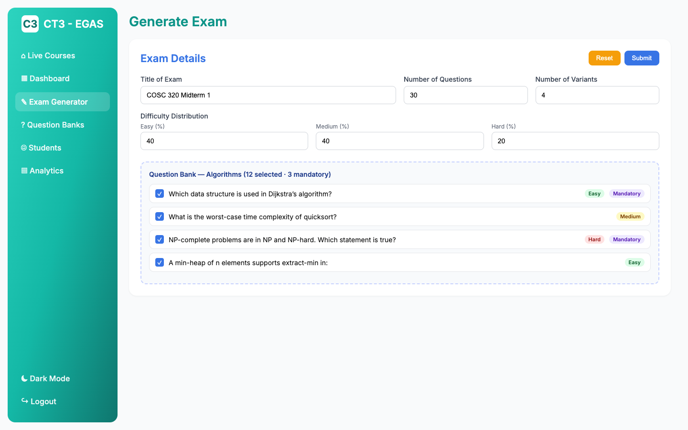
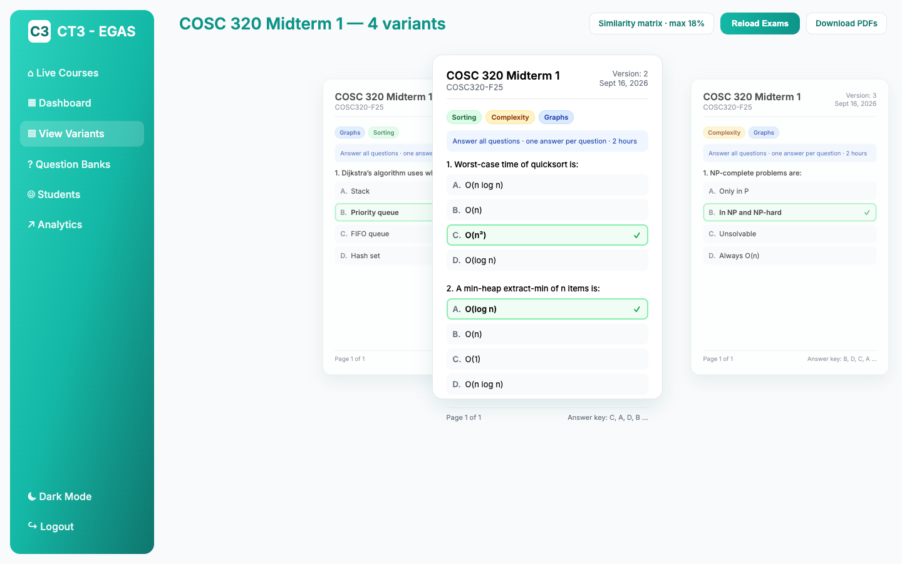
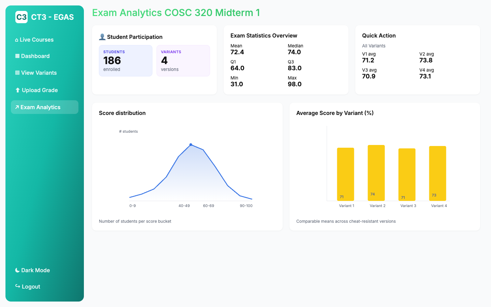
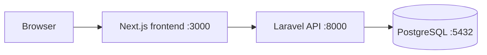

# Exam Generation and Analytics

A web platform that generates cheat-resistant multiple-choice exam versions and turns uploaded scores into class analytics.

Professors spend hours building alternate exams by hand, then have no fast way to see which questions failed the room. This app is for instructors and TAs: upload a question bank, set version count and difficulty mix, download print-ready variants whose answer keys barely overlap, then upload scores and read the dashboard. Built as a UBC COSC 499 capstone by Team CT3.

## Screenshots

**Exam configuration:** title, version count, difficulty mix, and question-bank selection (including mandatory items).



**Generated exam:** a carousel of variants with shuffled question order, rotated options, and a similarity readout.



**Analytics dashboard:** participation, mean/median/IQR, score distribution, and per-variant averages.



## Tech stack

- **Frontend:** Next.js 15, React 19, Tailwind CSS, D3.js, Recharts
- **Backend:** Laravel 12 (PHP 8.2), Laravel Sanctum
- **Database:** PostgreSQL 15
- **PDF / files:** in-browser PDF (jsPDF / pdf-lib), Excel/CSV via ExcelJS and PapaParse
- **Infra:** Docker Compose, three containers (frontend, backend, database)
- **CI:** GitHub Actions, Jest, PHPUnit

## Architecture

The Next.js app is the professor/TA UI. It calls a Laravel REST API over Axios, authenticated with Sanctum personal access tokens. Laravel owns classrooms, question banks, grading uploads, and analytics queries. PostgreSQL stores the relational data; on boot the backend container applies the DDL, runs migrations, and seeds demo records. Docker Compose runs exactly three services, mapped to localhost:3000 (UI), :8000 (API), and :5432 (Postgres).



## Getting started

```bash
cd app
cp .env.example .env && cp .env.example backend/.env
docker compose up --build
```

Open [http://localhost:3000](http://localhost:3000) and sign in. There is no public signup; Compose migrates and seeds a demo professor on startup:

- Email: `professor@example.com`
- Password: `password`

An admin account is also seeded by migration: `admin1@admin.com` / `Adminpassword123` (opens the admin monitor, not the professor exam flow).

## Testing and CI

```bash
# PHPUnit (Laravel unit + feature tests)
cd app/backend && php artisan test

# Jest (Next.js component tests)
cd app/frontend && npm test
```

Inside Compose: `docker compose exec backend php artisan test` and `docker compose exec frontend npm test`.

The GitHub Actions workflow (`.github/workflows/test.yml`) runs on push and pull request to the `Front-End` branch. It installs Node 20, builds the Next.js app, and runs Jest. PHPUnit is run locally or via Compose; it is not part of that workflow.

## How similarity minimization works

Each variant always includes every question marked mandatory, then fills the remaining slots from the bank with a seeded shuffle so versions stay comparable in length and difficulty. Questions are grouped by topic tag; both the order of tags and the order within a tag are shuffled, so two students sitting together do not see the same sequence. Option order is shuffled with a deterministic RNG, which moves the correct letter (A/B/C/D) independently per version. The generator then compares answer keys pairwise: similarity is the fraction of positions that share the same letter. If any pair is more than 20% similar, it reassigns options on the offending variant, scoring candidate letters against every other version and keeping the assignment that maximizes disagreement. A short random pass breaks leftover runs of identical keys. A Laravel endpoint implements the same idea server-side (label rotation plus a retry loop against a configurable threshold, default 0.65).

## Team

Aliasgar Sakarwala, Ali Afoud, Sahil Chawla, Samyak Jain, Arjun Sampat, Christian Eziekwu, Cooper Ross.

**My contribution:** Led UI/UX design; contributed frontend development of authentication, TA views, student roster, and analytics screens, plus Jest coverage.

Planning notes, requirements, and the original milestone schedule live in the [project proposal](docs/PROPOSAL.md).
